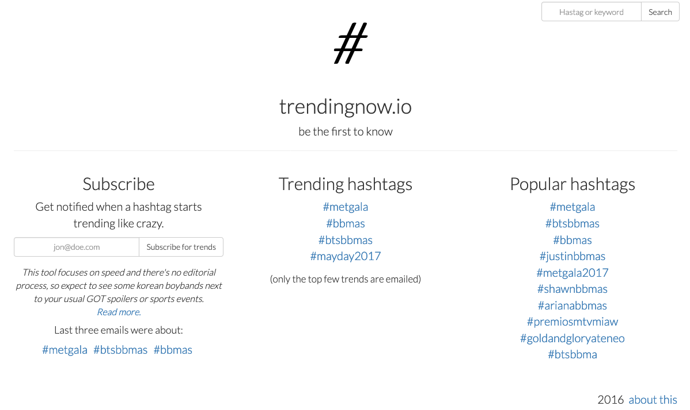

# trendingnow.io

Constantly scans twitter stream for huge trends and emails you if it finds something. I cannot say that worked as reliable as I had hoped, but it was a cool proof of concept. No longer maintained.
